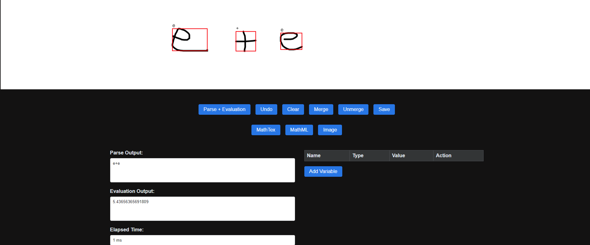

# SketchCalc

SketchCalc is an interactive web application that allows users to draw mathematical expressions directly on a canvas. The application uses machine learning to predict the drawn symbols and converts them into a formal mathematical expression. It then evaluates the expression to provide the calculated answer.



## Features

- **Drawing Canvas**: Users can draw mathematical symbols and expressions on a canvas using mouse input.
- **Real-time Prediction**: The application predicts the drawn symbols and converts them into mathematical notation.
- **Bounding Box Calculation**: Drawn symbols are enclosed in bounding boxes to isolate individual symbols.
- **Integration and Differentiation**: Supports integral and differential calculus with custom variables.
- **Evaluation**: The predicted mathematical expressions are evaluated to provide the answer.
- **Custom Variables**: Users can include custom variables in their expressions.
- **Elapsed Time Measurement**: The time taken to parse and evaluate the drawing is displayed.

## How It Works

1. **Drawing**: Users draw mathematical expressions on the canvas.
2. **Path Storage**: The paths of the drawings are stored and processed to determine bounding boxes.
3. **Prediction**: Each bounding box is sent to a server that uses a machine learning model to predict the symbol.
4. **Display**: The predicted symbols are displayed on the canvas.
5. **Calculation**: The final expression is evaluated, and the result is displayed to the user.

## Example Usage

- Draw an integral on the canvas, and the application will recognize it as an integral symbol, convert it to the proper mathematical notation, and calculate the result.
- Use custom variables in your expressions to evaluate them dynamically.

## Technology Stack

- **Frontend**: JavaScript, HTML5 Canvas, CSS
- **Backend**: Flask (for prediction API)
- **Machine Learning**: TensorFlow

## Installation

1. Clone the repository:
    ```bash
    git clone https://github.com/Frost-Lord/SketchCalc.git
    cd SketchCalc
    ```
2. Download the model and dataset
    ```bash
    https://drive.google.com/drive/folders/1u9L_ByfnE8vfx2AMju7VChWGTsQkbbgm?usp=sharing
    Extract "model.keras" to -> ./
    Extract "dataset" to -> ./
    ```
3. Install dependencies:
    ```bash
    pip install -r requirements.txt
    ```
4. Run the server:
    ```bash
    python web.py
    ```
5. Open `index.html` in your browser to start drawing and calculating.


# Dev Notes:

## Testing on Windows
```bash
# Create a new virtual environment
python -m venv venv

# Activate the virtual environment
.\venv\Scripts\activate

# Keras to tflite
python convert_to_tflite.py -i model.keras -o model.tflite
```